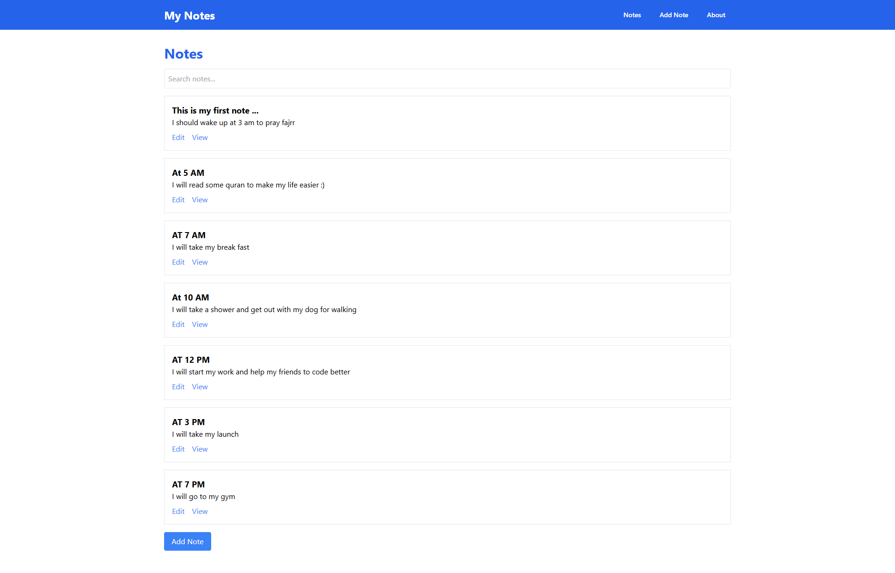
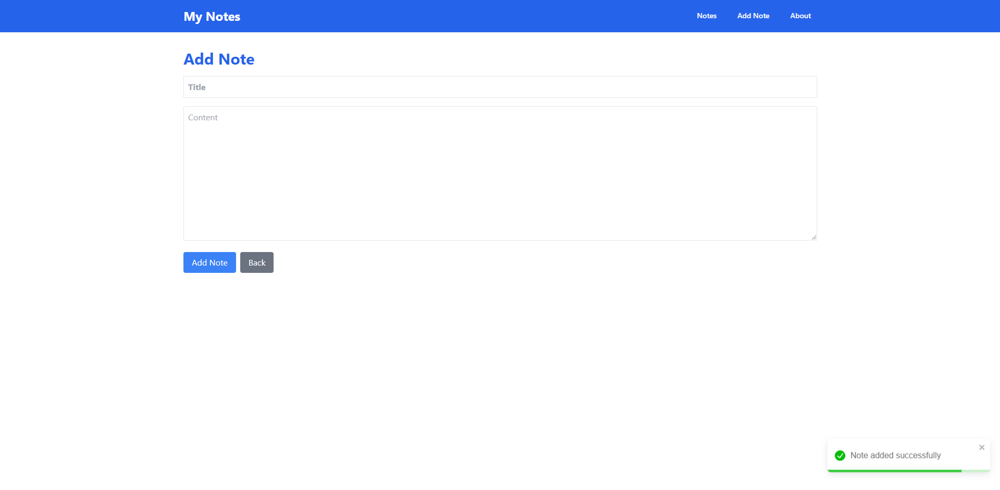
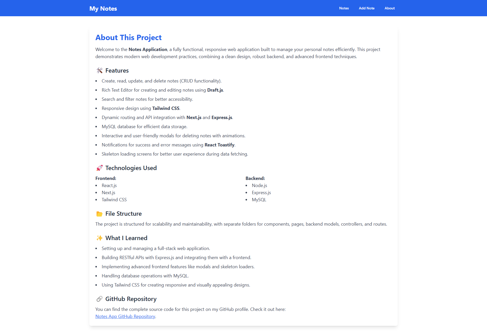
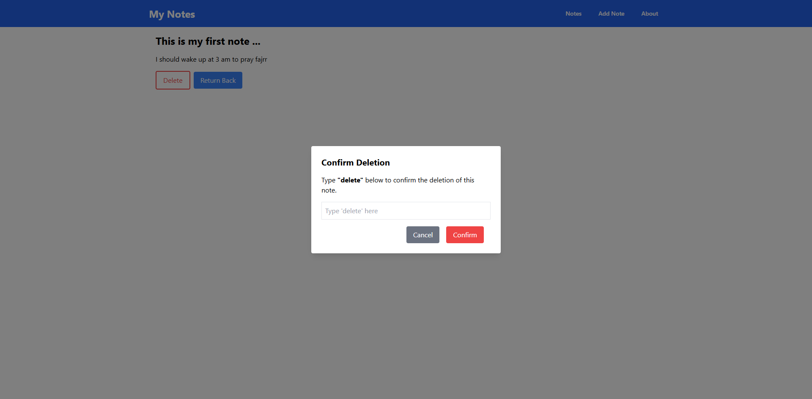

# Notes Application 📝

This is a full-stack notes application built with **Node.js**, **Express.js**, **MySQL**, and **React.js** (using React Router). It allows users to create, view, edit, and delete notes with additional features like search, modals, spinners, and more.

---

## Screenshots

### Note Home



### Add Note



### About



### Delete



## Features ✨

- **Frontend:**
  - Built with **React.js**.
  - Routing handled by **React Router**.
  - Modern UI design using **Tailwind CSS**.
  - Interactive modals for deleting notes with animations.
  - Toast notifications for success and error messages using **react-toastify**.
  - spinners loading for better UX during data fetching.

- **Backend:**
  - Built with **Express.js**.
  - **MySQL** database support for storing notes.
  - RESTful API endpoints with proper error handling.

- **Core Functionalities:**
  - Create, view, update, and delete notes.
  - Search and filter notes.
  - Validation for input fields and confirmation dialogs.

---

## Tech Stack 💻

### Frontend
- **React.js**: Framework for building UI.
- **Tailwind CSS**: Utility-first CSS framework.
- **React Router**: For navigation and routing.
- **react-toastify**: Toast notifications for user feedback.

### Backend
- **Node.js**: JavaScript runtime for backend development.
- **Express.js**: Web framework for building APIs.
- **MySQL**: Database for storing notes.
- **Axios**: HTTP client for making API calls.

---

## Installation 🛠️

### Backend Setup
1. Clone the repository.
2. Navigate to the `backend` folder:

   ```bash
   cd backend
   ```

3. Install dependencies:

   ```bash
   npm install
   ```

4. Open a `config/config.js` file in the `backend` directory and setup your database with your information:

   ```js
      const { Sequelize } = require('sequelize');

      const sequelize = new Sequelize('YOUR_DB', 'root', 'YOUR_ROOT_PASSWORD', {
        host: 'localhost',
        dialect: 'mysql'
      });

      module.exports =  sequelize;
   ```

5. Start the server:

   ```bash
   npm start
   ```

   The backend will run on `http://localhost:5000` by default.

### Frontend Setup
1. Navigate to the `frontend` folder:

   ```bash
   cd frontend
   ```

2. Install dependencies:

   ```bash
   npm install
   ```

3. Start the React development server:

   ```bash
   npm start
   ```

   The frontend will run on `http://localhost:3000` by default.

---

## API Endpoints 🌐

### Base URL
`http://localhost:5000/api`

### Endpoints
| Method | Endpoint         | Description          |
|--------|------------------|----------------------|
| GET    | `/notes`         | Fetch all notes      |
| GET    | `/notes/:id`     | Fetch a single note  |
| POST   | `/notes`         | Create a new note    |
| PUT    | `/notes/:id`     | Update a note        |
| DELETE | `/notes/:id`     | Delete a note        |

---

## Folder Structure 📂

### Backend
```
backend/
├── models/
│   └── Note.js          # Database model for notes
├── routes/
│   └── noteRoutes.js    # Routes for note-related API endpoints
├── controllers/
│   └── noteController.js # Controller functions for notes
├── config/
│   └── config.js            # Database configuration
├── server.js            # Main server file
└── .env                 # Environment variables
```

### Frontend
```
frontend/
├── src/
│   ├── Components/
│   │   ├── NoteCard/    # Reusable note card component
│   │   ├── LoadingSpinner/ # Loading spinner component
│   │   ├── DeleteModal/ # Delete confirmation modal
│   │   └── Navbar/      # Navbar component
│   ├── Config/
│   │   └── axiosConfig.js # Axios configuration file
│   ├── Context/
│   │   └── LoadingContext.js # Context for loading state management
│   ├── Pages/
│   │   ├── Home.js      # Home page listing all notes
│   │   ├── AddNote.js   # Add note page
│   │   ├── EditNote.js  # Edit note page
│   │   └── About.js     # About page
│   ├── App.js           # Main app entry
│   └── index.js         # React app root
└── public/              # Static assets
```

---

## How It Works 🖋️

1. **Add Note:** Navigate to the "Add Note" page, enter a title and content using the rich text editor, and save the note.
2. **View Notes:** The home page lists all notes with a preview of their content.
3. **Edit Note:** Click on a note to edit its content in a text editor.
4. **Delete Note:** Click the delete button, confirm the action in a modal, and remove the note.
5. **Search Notes:** Use the search bar to filter notes by title or content.

---

## Contributions 🤝
Feel free to fork the repository and submit pull requests for improvements or additional features!

---

## License 📜
This project is licensed under the MIT License. See the LICENSE file for details.

---

## Acknowledgments 🙌
Special thanks to open-source contributors and libraries that made this project possible!